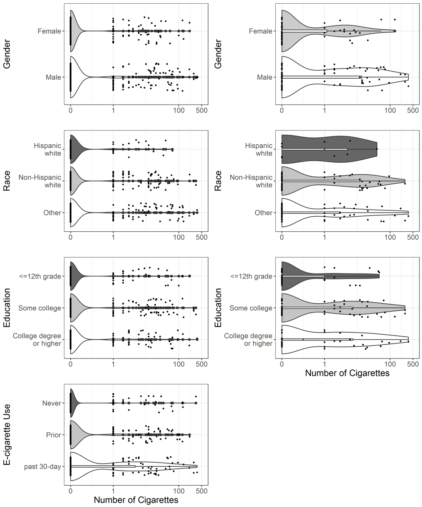
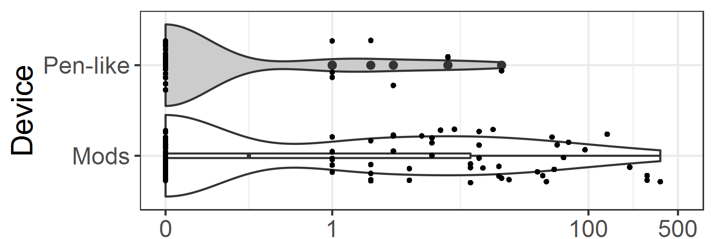
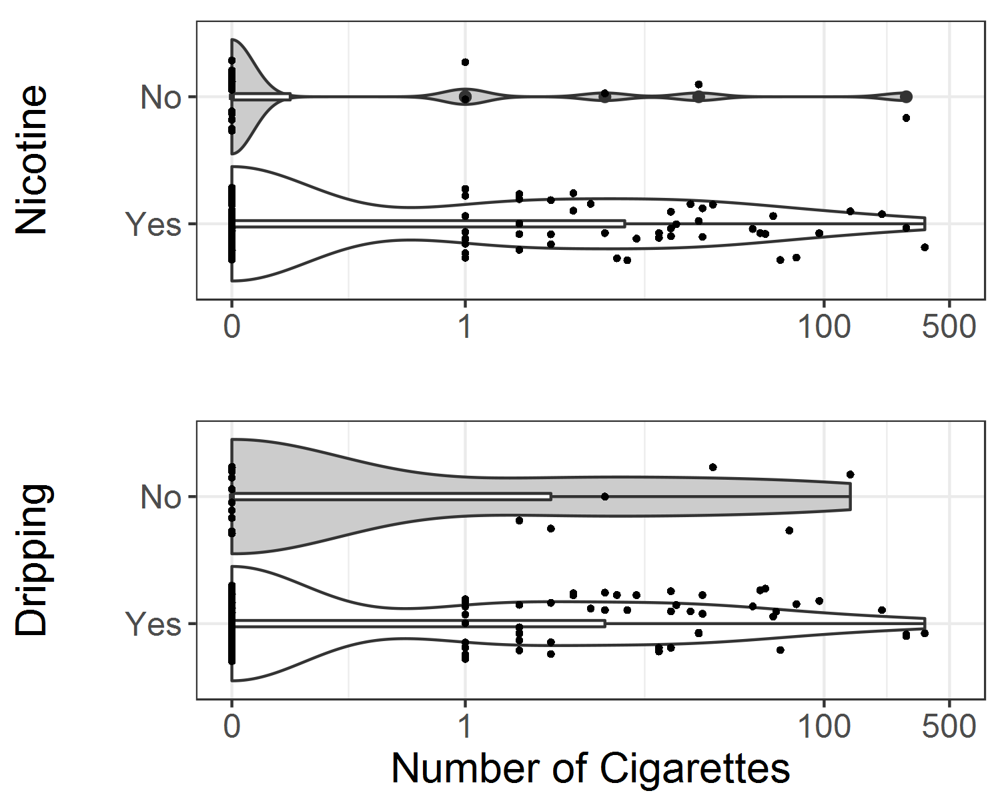

---
# PLEASE SEE THE README for in depth description github.com/brentthorne/posterdown
poster_height: "48in"
poster_width: "36in"
emph_size: 0.2 #percent coverage of the poster
emphb_size: 0.1
font_family: 'Rasa'
#ESSENTIALS
title: '**E-Cigarette Product Characteristics and Subsequent Frequency of Cigarette Smoking**'
author:
  - name: 'Jessica L. Barrington-Trimis'
    affil: 1,*
    main: true
    twitter: Doctor_BT
  - name: Zhi Yang
    affil: 1
    main: true
    twitter: zhiiiyang
  - name: Sara Schiff
    affil: 1
  - name: Jennifer Unger
    affil: 1
  - name: Tess Boley Cruz
    affil: 1
  - name: Robert Urman
    affil: 1
  - name: Junhan Cho
    affil: 1
  - name: Jonathan Samet
    affil: 2
  - name: Adam M. Leventhal
    affil: 1
  - name: Kiros Berhane
    affil: 1
  - name: Rob McConnell
    affil: 1
affiliation:
  - num: 1
    address: Department of Preventive Medicine, University of Southern California, Los Angeles, CA
  - num: 2
    address: Colorado School of Public Health, Aurora, CO
#Column
column_numbers: 3
#STYLE & FORMATTING
title_textsize: "45pt"
author_textsize: "1em"
authorextra_textsize: "35px"
affiliation_textsize: "25px"
affiliation_textcol: '#00000080'
caption_fontsize: "20pt"
#Middle of the poster
middle_fontfamily: "PT Sans"
middle_textcol: "#ffffff"
middle:textalpha: 150
middle_fontsize: "180px"
main_findings:
  - "Young adults using mod (vs. pen-like) e-cigarette devices at baseline smoked **more than 6 times** as many cigarettes in the past 30 days at follow-up."
logoleft_name: "Figures/usc.jpg"
logoright_name: "Figures/qr-code-black.png"
#---POSTER BODY OPTIONS---#
primary_colour: '#a21933'
accent_colour: "#777777"
body_bgcol: "#ffffff"
body_textsize: "45px"
body_textcol: "#000000"
reference_textsize: "23px"
#--Standard Options--#
output: 
  posterdown::posterdown_betterport:
    self_contained: false
    pandoc_args: --mathjax
    highlight: espresso
    number_sections: true
bibliography: MyBib.bib
---
```{r setup, include=FALSE}
knitr::opts_chunk$set(
  results = 'asis',
  echo = FALSE,
  warning = FALSE,
  message = FALSE,
  fig.align = 'center'
)
library(readxl)
library(magrittr)
library(knitr)
library(kableExtra)
library(formattable)

```

# Introduction

Evidence that use of **e-cigarettes** with certain product characteristics may `increase` adolescent and young adult risk of unhealthy tobacco use patterns—such as frequency of combustible cigarette smoking—can inform regulation of e-cigarettes. 

# Methods

- Data were collected via online survey from participants in the Southern California Children’s Health Study in 2015-2016 (baseline) and 2016-2017 (follow-up) (**N=1312**). 
- We evaluated the association of binary categories of three non-mutually exclusive characteristics of the e-cigarette used most frequently with number of cigarettes smoked in the past 30 days at 1-year follow-up.
- Product characteristics included `device` (pen-like/mod [modifiable device]), use of `nicotine` in eliquid solutions (yes/no), and use for `dripping` (directly dripping eliquid onto the device for high levels of nicotine; yes/no).

```{r, echo=FALSE, fig.cap="The distribution of past-30-day cigarette use at follow-up for the (L) overall sample, and (R) sample of past 30-day e-cigarette users, by demographics.", out.width = '100%', fig.align="left"}

```


<br />
<br />


```{r, out.width='100%', fig.align='center'}
table1 <- read_excel("table1.xlsx")
colnames(table1)[1] <- ""

table1 %>% 
  kable(caption = 'Participant characteristics at baseline and association of each characteristic with number of cigarettes smoked in the past 30 days at follow-up; N = 1312.', align = 'c') %>%
  kable_styling(bootstrap_options = "striped", font_size = 30) %>%
  row_spec(0, color = "black", background = "lightgrey") %>%
  column_spec(2, width = "15%") %>%
  column_spec(3, width = "30%") %>%
  pack_rows("Gender", 1, 2) %>%
  pack_rows("Race/ethnicity", 3, 5) %>%
  pack_rows("Education (highest parental)", 6, 8) %>%
  pack_rows("E-cigarette use", 9, 11)
```

# Results

Usually you want to have a nice table displaying some important results that you have calculated. In `posterdown` this is as easy as using the `kable` table formatting you are probably use to as per typical R Markdown formatting.

```{r, echo=FALSE, fig.cap="", out.width = '100%', fig.align="left"}

```

```{r, echo=FALSE, fig.cap="The distribution of past-30-day cigarette use at follow-up by four e-cigarette characteristics of current e-cigarette at baseline.", out.width = '100%', fig.align="left"}

```

```{r, out.width='100%', fig.align='center'}
table2 <- read_excel("table2.xlsx")
colnames(table2)[1] <- ""
table2[6:7, 5] <- ""

table2 %>% 
  kable(caption = 'Association between e-cigarette characteristics at baseline and number of cigarettes smoked in the past 30 days at follow-up; N=1312', align = 'c') %>%
  add_header_above(c(" " = 2, 
    "Association with Number of Cigarettes Smoked in Past 30 Days at Follow-up" = 3)) %>%
  kable_styling(bootstrap_options = "striped", font_size = 30, full_width = F) %>%
  row_spec(0, color = "black", background = "lightgrey") %>%
  column_spec(2, width = "20%") %>%
  column_spec(1, width = "25%") %>%
  pack_rows("Device type", 2, 3， latex_gap_space = "1") %>%
  pack_rows("Nicotine", 4, 5) %>%
  pack_rows("Dripping", 6, 7)
```


# Conclusion

Use of mods (vs. pen-like) e-cigarette devices was **strongly, positively associated** with the number of cigarettes smoked approximately 1 year later at follow-up. Additional research is needed to explore `causal pathways for the observed associations`. If these associations were causal, device type and characteristics may be a target for regulation to reduce the burden of tobacco related disease that may result from adolescent and young adult vaping.

# Disclosures

- This research study was supported by grant numbers P50CA180905 and U54CA180905 from the National Cancer Institute at the National Institutes of Health (NIH) and the Food and Drug Administration Center for Tobacco Products, grant number K01DA042950 from the National Institute for Drug Abuse at NIH, and grant 27-IR-0034 from the Tobacco Related Disease Research Program.
- The authors have no financial relationships relevant to this article to disclose.
- The authors have no conflicts of interest relevant to this article to disclose. Robert Urman began a position at Amgen on April 15, 2019 and did not contribute to the paper after that date.

# References
